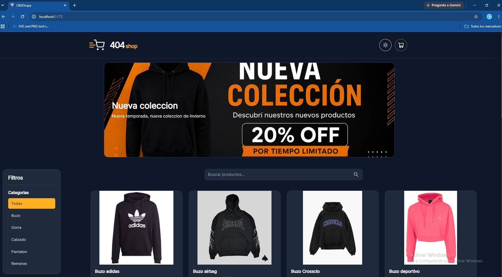
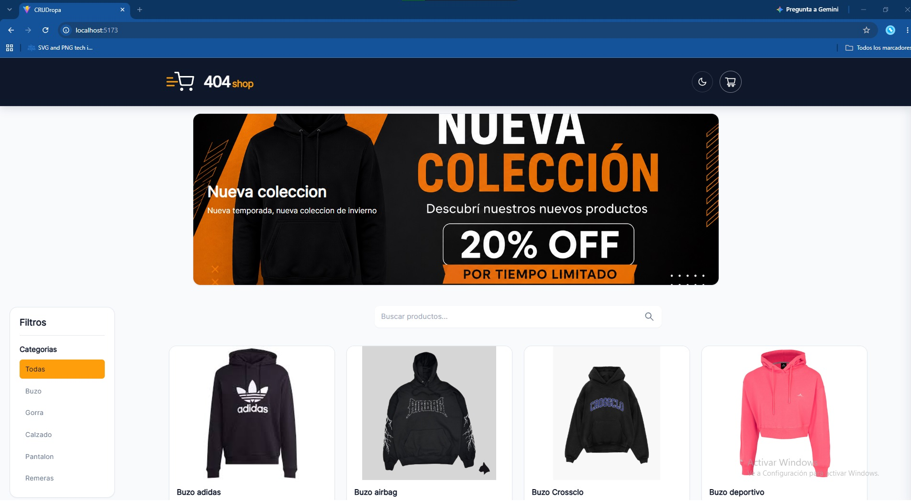
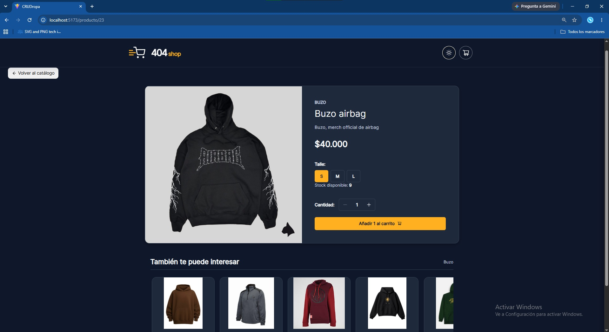
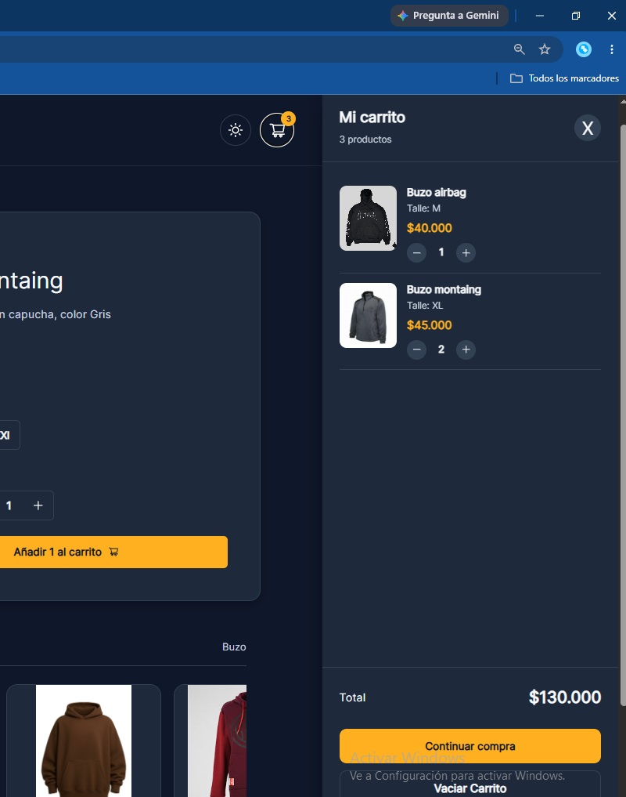
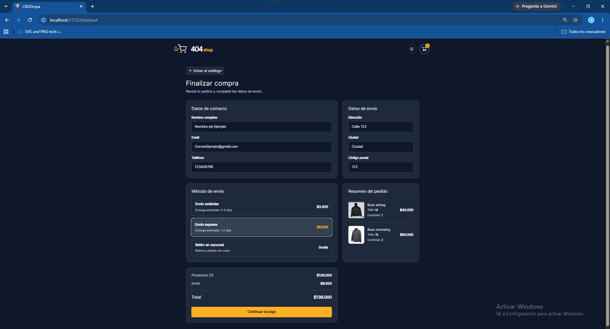
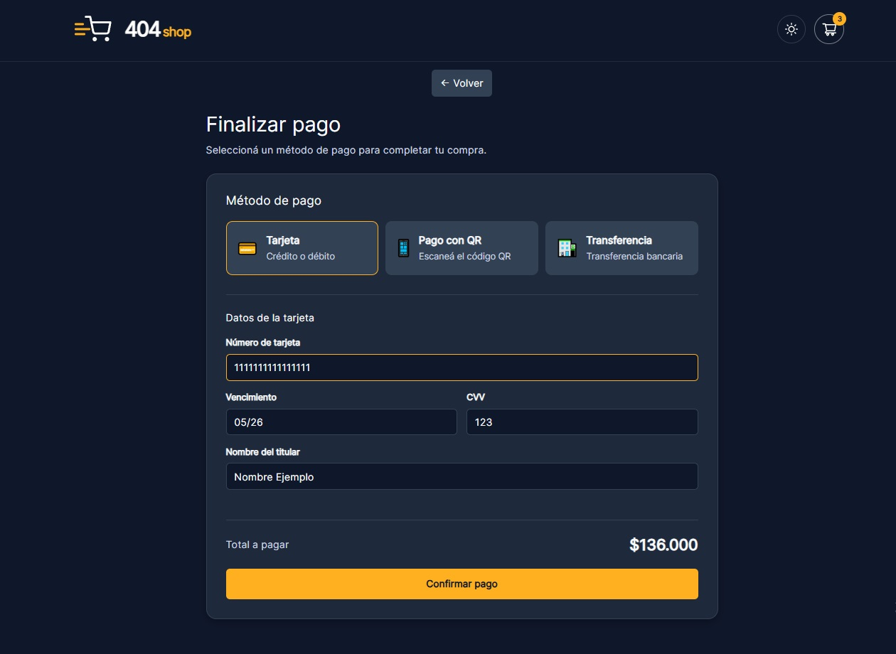
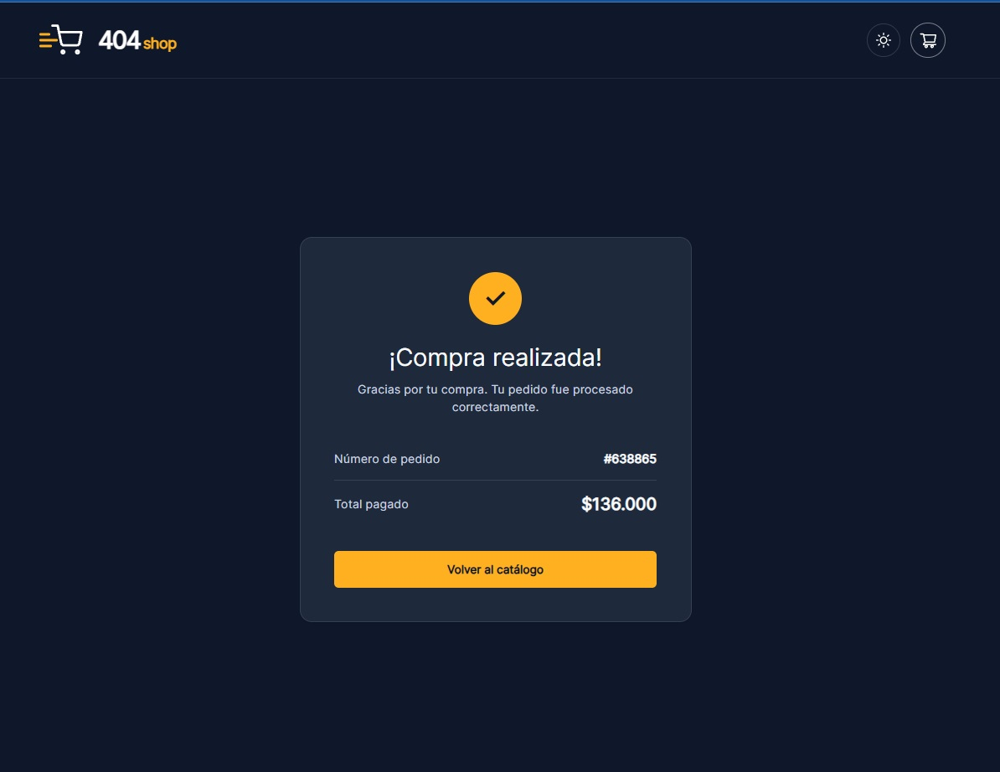
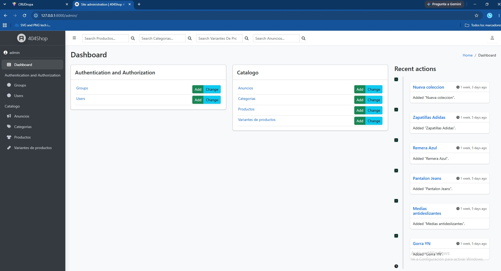

# 404Shop

E-commerce de indumentaria desarrollado con **Django REST Framework** y **React**.

404Shop es una aplicación web que permite consultar un catálogo de productos, seleccionar variantes por talle, gestionar un carrito de compras y completar un proceso de compra con diferentes métodos de pago simulados.

El proyecto cuenta con un backend desarrollado en Django REST Framework, un frontend desarrollado con React y una base de datos PostgreSQL.

---

## 🎯 Objetivo del proyecto

El objetivo de 404Shop es desarrollar una aplicación e-commerce full stack que permita poner en práctica conocimientos de desarrollo frontend y backend, integración de APIs, manejo de bases de datos y organización de un proyecto dividido en diferentes capas.

Durante el desarrollo se trabajó especialmente con:

- Desarrollo de una API REST.
- Integración entre React y Django.
- Modelado de productos y variantes.
- Gestión de stock por talle.
- Carrito de compras.
- Proceso de checkout.
- Validación de formularios.
- Actualización del stock mediante el backend.
- PostgreSQL.
- Docker.

---

**Proyecto funcional.**

Proyecto desarrollado como parte de mi proceso de aprendizaje y preparación para el ámbito profesional.

> Los métodos de pago incluidos en el proyecto son simulados y no realizan transacciones reales.

---

## 🚀 Funcionalidades

### 🛍️ Catálogo de productos

El catálogo permite visualizar los productos disponibles en la tienda y acceder al detalle de cada uno.

Cada producto muestra información como:

- Imagen.
- Nombre.
- Categoría.
- Descripción.
- Precio.
- Talles disponibles.
- Stock disponible.

---

### 📏 Variantes por talle

Los productos pueden contar con diferentes variantes según el talle.

Cada variante mantiene su propio stock de manera independiente.

Ejemplo:

```text
Remera básica

S   → 5 unidades
M   → 8 unidades
L   → 4 unidades
XL  → 2 unidades

```

### 🛒 Carrito de compras
El usuario puede agregar productos al carrito seleccionando previamente el talle y la cantidad.

El carrito permite:

- Visualizar los productos seleccionados.
- Identificar el talle elegido.
- Modificar cantidades.
- Eliminar productos.
- Visualizar el total de la compra.
- Continuar hacia el proceso de checkout.

### 📦 Checkout
El proceso de checkout permite ingresar los datos necesarios para realizar la compra.
Incluye:

- Datos de contacto.
- Dirección de envío.
- Selección del método de envío.
- Cálculo del costo de envío.
- Cálculo del total final.

El total se actualiza automáticamente según los productos seleccionados y el método de envío.

### 🚚 Métodos de envío
El usuario puede seleccionar diferentes opciones de envío.
El costo correspondiente se incorpora automáticamente al total de la compra.

###  📦 Control de stock
Al confirmar una compra, el backend vuelve a verificar que exista stock suficiente para cada variante seleccionada.
Si la compra es válida, el stock correspondiente se descuenta automáticamente.
De esta manera, el stock no depende únicamente de la información mostrada en el frontend.

### ✅ Confirmación de compra
Una vez confirmada correctamente la compra, el usuario es dirigido a una pantalla de confirmación.

La página muestra:

- Confirmación de la compra.
- Número de pedido.
- Total pagado.
- Opción para volver al catálogo.

Además, el carrito se vacía después de completar correctamente la compra.

### 📢 Sistema de anuncios
El proyecto cuenta con un sistema de anuncios administrable desde el backend.

Los anuncios pueden configurarse desde el panel de administración y posteriormente mostrarse en diferentes posiciones dentro del frontend.

Cada anuncio puede incluir:

- Título.
- Descripción.
- Imagen.
- Posición.
- Estado activo/inactivo.
- Fecha de inicio.
- Fecha de finalización.

### ⚙️ Panel de administración
El backend cuenta con un panel de administración desarrollado con Django y personalizado mediante Django Jazzmin.

Desde el panel se pueden gestionar los principales elementos del sistema, incluyendo:

- Productos.
- Categorías.
- Variantes.
- Stock.
- Anuncios.

### 🌓 Tema claro y oscuro
El frontend incluye un sistema de cambio entre tema claro y tema oscuro.
La interfaz adapta sus estilos según el tema seleccionado por el usuario.

### 📱 Diseño responsive
La interfaz está diseñada para adaptarse a diferentes tamaños de pantalla, permitiendo utilizar la aplicación desde distintos dispositivos.

---

## 📸 Capturas del proyecto

### 🛍️ Catálogo de productos

#### Modo oscuro

#### Modo claro


---

### 📦 Detalle del producto



---

### 🛒 Carrito de compras



---

### 🧾 Checkout



---

### 💳 Método de pago



---

### ✅ Compra exitosa



---

### ⚙️ Panel de administración



---

## 🛠️ Tecnologías utilizadas
### Backend

- **Python**
- **Django**
- **Django REST Framework**
- **PostgreSQL**

### Frontend

- **React**
- **Vite**
- **Axios**
- **React Router**
- **CSS**

### Administración y configuración

- **Django Jazzmin** — Personalización del panel de administración.
- **python-decouple** — Gestión de variables de entorno.
- **django-cors-headers** — Configuración de comunicación entre frontend y backend.

### Herramientas y entorno

- **Docker** — Contenedorización del proyecto.
- **Git** — Control de versiones.
- **GitHub** — Repositorio y publicación del código.

---

## 🏗️ Arquitectura y estructura del proyecto

404Shop está dividido en dos partes principales:

- **Backend:** desarrollado con Django REST Framework.
- **Frontend:** desarrollado con React y Vite.

El frontend se comunica con el backend mediante una API REST, mientras que PostgreSQL se utiliza como sistema de gestión de base de datos.

### 📁 Estructura general

```text
404Shop/
│
├── backend/
│   ├── catalogo/
│   │   ├── migrations/
│   │   ├── __init__.py
│   │   ├── admin.py
│   │   ├── apps.py
│   │   ├── models.py
│   │   ├── serializers.py
│   │   ├── tests.py
│   │   ├── urls.py
│   │   └── views.py
│   │
│   ├── config/
│   │   ├── __init__.py
│   │   ├── asgi.py
│   │   ├── settings.py
│   │   ├── urls.py
│   │   └── wsgi.py
│   │
│   ├── Dockerfile
│   ├── manage.py
│   └── requirements.txt
│
├── docs/
│   └── screenshots/
│
├── frontend/
│   ├── public/
│   ├── src/
│   │   ├── api/
│   │   ├── assets/
│   │   ├── components/
│   │   │   ├── Anuncios.jsx
│   │   │   ├── CarruselProduct.jsx
│   │   │   ├── Logo.jsx
│   │   │   ├── Navbar.jsx
│   │   │   ├── ProductCard.jsx
│   │   │   └── ThemeToggle.jsx
│   │   │
│   │   ├── pages/
│   │   │   ├── Checkout.jsx
│   │   │   ├── CompraExitosa.jsx
│   │   │   ├── Pagos.jsx
│   │   │   ├── PagProducts.jsx
│   │   │   └── ProductDetail.jsx
│   │   │
│   │   ├── styles/
│   │   ├── App.css
│   │   ├── App.jsx
│   │   ├── index.css
│   │   └── main.jsx
│   │
│   ├── .gitignore
│   ├── eslint.config.js
│   ├── index.html
│   ├── package.json
│   ├── package-lock.json
│   └── vite.config.js
│
├── .gitignore
├── docker-compose.yml
└── README.md 
```

### 🔙 Backend
El backend está desarrollado con Django REST Framework y se encarga de la lógica de negocio, gestión de datos y exposición de la API REST.

La aplicación `catalogo` contiene los modelos, serializers, vistas, rutas y configuración del panel de administración.

### 🎨 Frontend

El frontend está desarrollado con React y Vite.

La carpeta `src/` está organizada principalmente en:

- `api/` — Comunicación con el backend.
- `components/` — Componentes reutilizables.
- `pages/` — Páginas principales de la aplicación.
- `styles/` — Estilos de la interfaz.

### 🐳 Docker

Docker se utiliza para facilitar la configuración y ejecución del entorno de desarrollo.

El proyecto utiliza Docker Compose para coordinar el backend y la base de datos PostgreSQL.

---

## 🔄 Flujo de compra

El proceso de compra de 404Shop sigue el siguiente flujo:

1. **Catálogo** — El usuario visualiza los productos disponibles.
2. **Producto** — Selecciona un producto, talle y cantidad.
3. **Carrito** — Revisa los productos seleccionados y modifica las cantidades si es necesario.
4. **Checkout** — Completa sus datos de contacto y dirección de envío.
5. **Envío** — Selecciona el método de envío y se actualiza el costo total.
6. **Pago** — Selecciona uno de los métodos de pago disponibles.
7. **Confirmación** — El backend verifica el stock y descuenta las unidades correspondientes.
8. **Compra exitosa** — Se muestra la confirmación del pedido y el total pagado.

---

## 🔌 API REST

El backend expone una API REST desarrollada con Django REST Framework que es consumida por el frontend mediante Axios.

### Principales endpoints

| Endpoint | Método | Descripción |
|---|---|---|
| `/api/v1/productos/` | GET | Obtiene el catálogo de productos y sus variantes. |
| `/api/v1/productos/{id}/` | GET | Obtiene el detalle de un producto específico. |
| `/api/v1/categorias/` | GET | Obtiene las categorías disponibles. |
| `/api/v1/anuncios/` | GET | Obtiene los anuncios activos. |
| `/api/v1/confirmar-compra/` | POST | Verifica el stock y confirma la compra. |

El frontend utiliza **Axios** para realizar las solicitudes al backend.

> La confirmación de compra realiza una nueva validación del stock en el backend antes de descontarlo.
---

## 🚀 Instalación y ejecución

### 📥 Clonar el repositorio

```bash
git clone https://github.com/CNBasualdo/404Shop.git
cd 404Shop
```

### 🐳 Ejecutar con Docker

El proyecto utiliza Docker Compose para ejecutar el backend y PostgreSQL.

``` bash
docker compose up --build
 ```

Una vez iniciados los servicios:
- Backend: http://127.0.0.1:8000

### 🎨 Ejecutar el frontend

Desde la raiz del proyecto ejecuta:

```bash 
cd frontend
npm install
npm run dev
``` 
El frontend estar disponible en:
- http://localhost:5173

---

## 🎯 Conclusión
404Shop es un proyecto full stack desarrollado para poner en práctica el desarrollo de aplicaciones web, integrando frontend, backend, base de datos y una API REST.

El proyecto forma parte de mi proceso de aprendizaje y crecimiento como desarrollador.

---